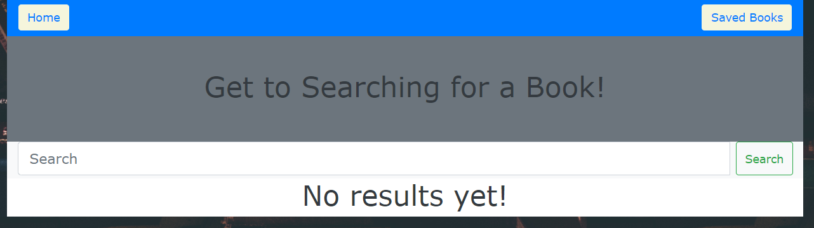
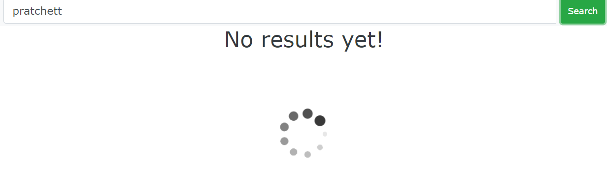
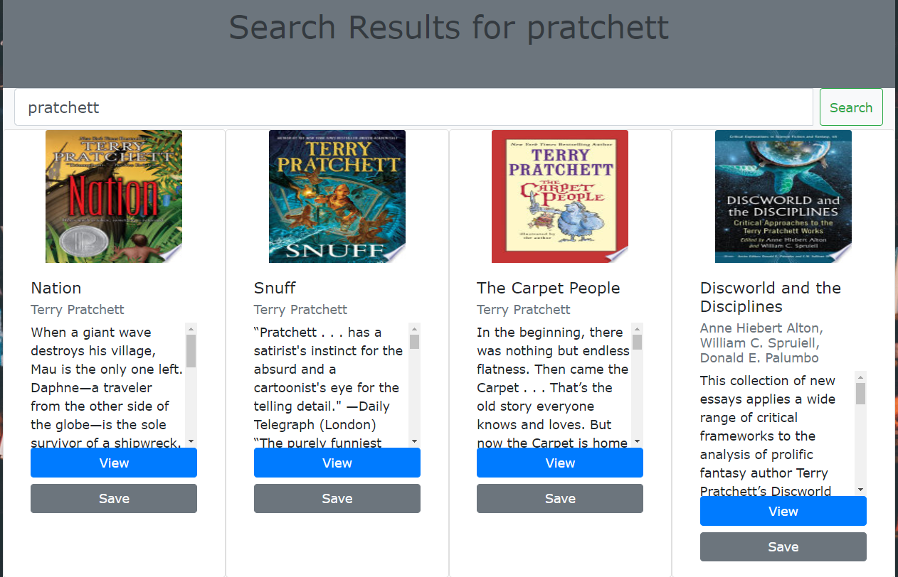
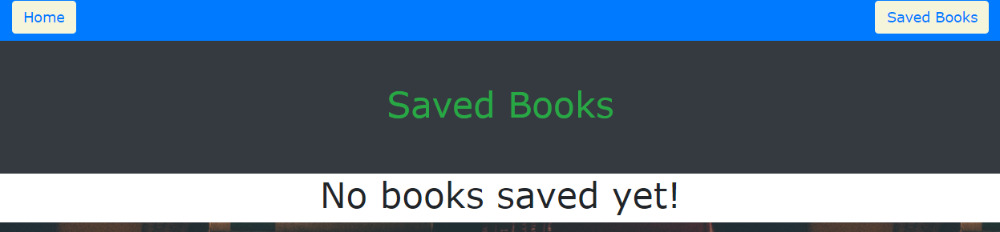
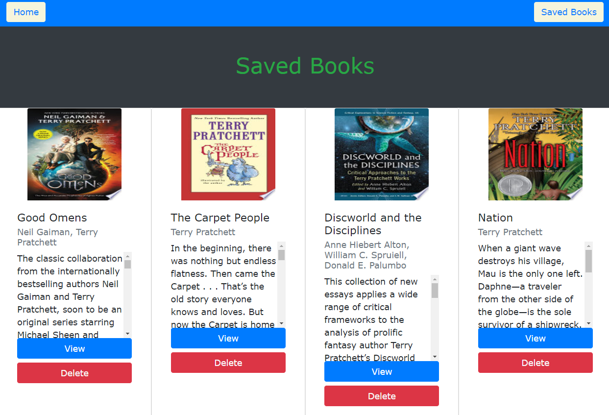

# book_search

[Deployed Site](https://mrrwmix-gbooks.herokuapp.com/)

# Description

This is a full MERN stack app that utilizes MongoDB, Express, React, and Node. MongoDB is used in conjunction with Mongoose to create a schema and manage the database programmatically. Express runs the server with Node. React runs the front end and updates dynamically depending on user input.

The app lets you search Google Books and save books that show up in your results. You may also find out more information on any given book through links provided by the Google Books API.

# Website sections

## Home Page

The Home page lets you search for books.

## Loading

A loading gif appears while results are being generated by the API.

## Results

An example of a search result.

## Default Saved Books Page

This is the default "Saved Books Page" with nothing saved.

## Saved Books

An example of saved books. Books on this page may be deleted.
